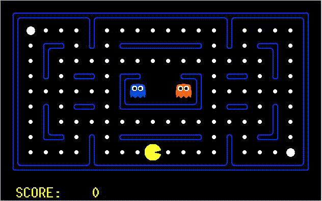

# Aritificial Intelligence: Pacman 

Project [Link](http://ai.berkeley.edu/project_overview.html)

Sections Of the Project Covered are:

**Search**: 
Implement depth-first, breadth-first, uniform cost, and A* search algorithms. These algorithms are used to solve navigation and traveling salesman problems in the Pacman world.

**Multi-Agent Search**: 
Classic Pacman is modeled as both an adversarial and a stochastic search problem. Implement multiagent minimax and expectimax algorithms, as well as designing evaluation functions.

**Reinforcement Learning**: 
Implement model-based and model-free reinforcement learning algorithms, applied to the AIMA textbook's Gridworld, Pacman, and a simulated crawling robot.

**Ghostbusters**: 
Probabilistic inference in a hidden Markov model tracks the movement of hidden ghosts in the Pacman world. Implement exact inference using the forward algorithm and approximate inference via particle filters.